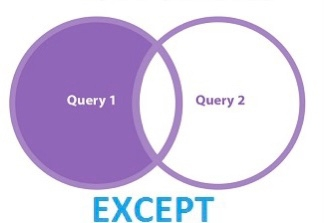

# Team Synergy

## <u>UNION Operator </u>

 

The UNION operator is used to combine the result-set of two or more SELECT statements.

* Every SELECT statement within UNION must have the same number of columns
* The columns must also have similar data types
* The columns in every SELECT statement must also be in the same order

     #### Code Sample:
        SELECT column_name(s) FROM table1 
        UNION 
        SELECT column_name(s) FROM table2;

## <u>UNION All</u>

* The UNION operator selects only distinct values by default. To allow duplicate values, use UNION ALL  

    #### Code Sample:
        SELECT column_name(s) FROM table1
        UNION ALL
        SELECT column_name(s) FROM table2;

## <u>EXCEPT</u>

* The SQL EXCEPT clause/operator is used to combine two SELECT statements and returns rows from the first SELECT statement that are not returned by the second SELECT statement. 
* This means EXCEPT returns only rows, which are not available in the second SELECT statement.
* Just as with the UNION operator, the same rules apply when using the EXCEPT operator. MySQL does not support the EXCEPT operator.

     #### Code Sample:
        SELECT Column-List FROM Table1
        EXCEPT
        SELECT Column-List FROM Table2

## <u>INTERSECT</u>

* The SQL INTERSECT clause/operator is used to combine two SELECT statements, but returns rows only from the first SELECT statement that are identical to a row in the second SELECT statement. 
* This means INTERSECT returns only common rows returned by the two SELECT statements.
* Just as with the UNION operator, the same rules apply when using the INTERSECT operator. MySQL does not support the INTERSECT operator.

     #### Code Sample:
        SELECT column_name(s) FROM table1
        INTERSECT
        SELECT column_name(s) FROM table2;

## <u>DDL TRIGGER</u>
* DDL triggers fire in response to a variety of Data Definition Language (DDL) events.

* These events primarily correspond to Transact-SQL statements that start with the keywords CREATE, ALTER, DROP etc.

## Use DDL triggers when you want to do the following :

* To Prevent certain changes to your database schema.

* If you want to execute some code in the response to a specific DDL event.

* Audit the changes that the user are making to the database structure.

## DDL TRIGGERS SCOPE
* Database Level scope
* Server Level scope

    #### Code Sample:
        CREATE TRIGGER [safety]   
        ON DATABASE   
        FOR DROP_TABLE, ALTER_TABLE   
        AS   
        PRINT 'You must disable Trigger "safety" to drop or alter tables!'   
        ROLLBACK; 

    usefull link - <https://learn.microsoft.com/en-us/sql/relational-databases/triggers/ddl-events?redirectedfrom=MSDN&view=sql-server-ver16>    
## ENABLE Trigger
* The ENABLE TRIGGER statement enables a trigger so that it will be fired whenever an event happens.

    #### Code Syntax

        ENABLE TRIGGER <trigger_name>
        ON [ALL SERVER | DATABASE | Object_Name]

## DISABLE Trigger
* The DISABLE TRIGGER statement deactivates a trigger so that it cannot be fired. Sometimes, we need to disable it.

    #### Code Syntax

        DISABLE TRIGGER <trigger_name>
        ON [ALL SERVER | DATABASE | Object_Name]

## DROP Trigger
* The DROP TRIGGER statement is used to drop one or more triggers from the database or server.

    #### Code Syntax

        DROP TRIGGER [IF EXISTS] <trigger_name>
        ON [ALL SERVER | DATABASE]

## <u>JOINS</u>
* JOINs are used in SQL to combine rows from two or more tables based on a related column between them. 
* They allow you to retrieve data from multiple tables in a single SELECT statement, rather than having to issue multiple SELECT statements and combine the results in your application code.
* Several operators can be used to join tables, such as =, <, >, <>, <=, >=, !=, BETWEEN, LIKE, and NOT; 
* they can all be used to join tables. However, the most common operator is the equal to symbol.
    
    #### Code Sample:
        SELECT * 
        FROM table1
        JOIN table2 
        ON table1.column1 = table2.column2

## <u>TYPES OF JOINS</u>
* INNER JOIN
* OUTER JOIN
    * LEFT OUTER JOIN
    * RIGHT OUTER JOIN
    * FULL OUTER JOIN
* CROSS JOIN
* SELF JOIN

## <u>INNER JOIN</u>

* An INNER JOIN returns only the rows that match between the two tables.
* It is the most common type of JOIN and is used when you want to retrieve only the matching rows from both tables.
   
   #### Syntax:
        SELECT columns    
        FROM table1    
        INNER JOIN table2 ON condition1  

## <u>OUTER JOIN</U>
* In the SQL outer JOIN all the content of the both tables are integrated together either they are matched or not.
* An OUTER JOIN returns all rows from one table and any matching rows from the other table. If there is no match, NULL values are returned for the non-matching columns. 
* There are three types of OUTER JOINs:
    * LEFT OUTER JOIN
    * RIGHT OUTRE JOIN
    * FULL OUTER JOIN

## <u>LEFT OUTER JOIN</u>

* Returns all rows from the left table (table1) and any matching rows from the right table (table2). 
* If there is no match, NULL values are returned for the non-matching columns in table2.

    #### Code Sample:
        SELECT table1.column1, table2.column2...
        FROM table1
        LEFT JOIN table2
        ON table1.common_field = table2.common_field;

## <u>RIGHT OUTER JOIN</u>

* Returns all rows from the right table (table2) and any matching rows from the left table (table1). 
* If there is no match, NULL values are return.

    #### Code Sample:
        SELECT table1.column1, table2.column2...
        FROM table1
        RIGHT JOIN table2
        ON table1.common_field = table2.common_field;

## <u>FULL JOIN</u>

* A FULL OUTER JOIN, also known as a FULL JOIN.
* The SQL FULL JOIN combines the results of both left and right outer joins.
* That returns all rows from both tables, regardless of whether there is a match
* The joined table will contain all records from both the tables and fill in NULLs for missing matches on either side.

    #### Code Sample:
        SELECT table1.column1, table2.column2...
        FROM table1
        FULL JOIN table2
        ON table1.common_field = table2.common_field;   

## <u>CROSS JOIN</u>

* In SQL, CROSS JOINs are used to combine each row of one table with each row of another table, and return the Cartesian product of the sets of rows from the tables that are joined.

    #### Code Sample:
        SELECT table1.column1, table2.column2...
        FROM  table1, table2 [, table3 ]

## <u>SELF JOIN</u>

* Referencing the same table more than once within a single query will result in an error. 
* To avoid this, SQL SELF JOIN aliases are used.
* The SELF JOIN in SQL, as its name implies, is used to join a table to itself. 
* This means that each row in a table is joined to itself and every other row in that table. 

     #### Code Sample:
        SELECT a.column_name, b.column_name...
        FROM table1 a, table1 b
        WHERE a.common_field = b.common_field;

    

