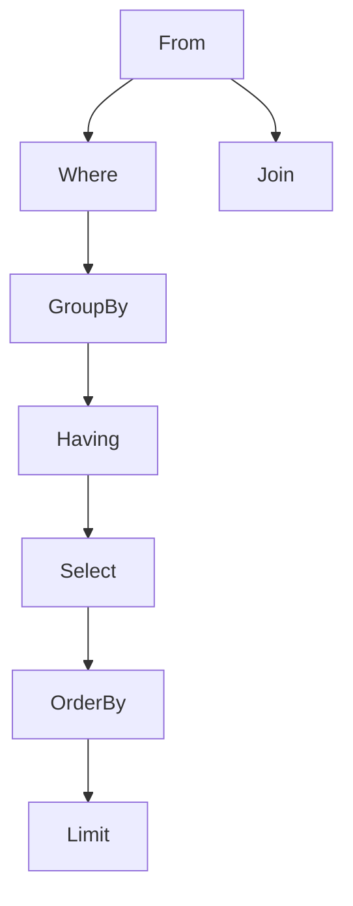

# select
- it is used to retrive the data from the table and display it
- ## example
- select * from employee;
- it shows the all the delails present in employee table

# operators in sql

<br>

## 1:arithematic operators=(+,-,*,/)
## 2:concatination operators=(||)
## 3:comparaision operators=(=,>,<,!)
## 4:relational operators=(>=,<=)
## 5:logical operators=(and,or,not)
## 6:special operators
1. IN
2. NOT IN 
3. BETWEEN
4. NOT BETWEEN
5. IS
6. NOT IS
7. LIKE
8. NOT LIKE

## 7:SUBQUERY OPERATORS:
1. ALL
2. ANY
3. EXISTS
----------------------------------------------------------------

# WHERE

## WHERE CLASS IS USED TO FILTER THE RECORDS.

- EXAMPLE:
- SELECT NAME FROM EMPLOYEE WHERE SAL >300;
- IT DISPLA THE EMPLOYEE WHOES SAL IS EARNING MOR THAN 300
----------------------------------------------------------------
# LIKE
- IT USED TO PERFORM PATTREN MATCHING
- TO ACHIVE PATTREN MATCHING WE USE SOME SPECIAL CHARACTER LIKE
- 1:PERSINTEL(%)
- 2:UNDERSCORE(_)
- EXAMPLE:
- SELECT NAME FROM EMPLOYEE WHERE NAME LIKE '%S'.
- IT SELECT THE NAME OF THE EMPLOYEE STARTING WITH THE CHARACTER A AND DISPLAY IT
-----------------------------------------------------------------
# SUSTRING
- IT IS USED TO EXTRACT PART OF STRING FROM GIVEN ORIGINAL STRING.
- SYNTAX:
- SUBSTR('ORIGINAL_STRING',Postion,Length)
- example:
- SELECT SUBSTR('REVEATURE',2,3) FROM EMPLOYEE
- ANSWER: E V E
- IT EXTRACT 2ND 3 CHARACTER FROM REVEATURE.
-----------------------------------------------------------------
# DISTINCT
- It is used to remove the duplicate or repeated values from the Result table
- ODER OF EXECUTION SELECT CLAUSE WILL RUN FIRST AND THEN DISTINCT CLAUSE
- EXAMPLE:
- SELECT DISTINCT NAME FROM EMPLOYEE ;
- IT DELETE OR REMOVE THE DUPLICATED NAME IN EMPLOYEE TABLE
-----------------------------------------------------------------
# AGGREGRATE (OR) MULTIROW FUNCTIONS:
- It takes all the inputs at one shot and then executes and provides A single output
- If we pass 'n' number of inputs to a MRF( ) it returns '1' Output
# List of MULTIROW FUNCTIONS ( ):
### 1. MAX( ) :
- it is used to obtain the maximum value present in the column
### 2. MIN ( ) :
- it is used to obtain the minimum value present in the
New Section 1 Page 2
column
### 3. SUM ( ) :
- it is used to obtain the summation of values present in the column
### 4. AVG( ) :
- it is used to obtain the average of values present in the column
### 5. COUNT( ) :
- it is used to obtain the number of values present in the column

<br><br>

# *SUBQUERY* , *FROM CLAUSE* , *WHERE CLAUSE*

## *DEFINATION:*

       - In SQL a Subquery can be simply defined as a query within another query.
       - In other words we can say that a Subquery is a query that is embedded in  another SQL query.


---------------------------------------------------------


## *IMPORTANT RULES THAT SUBQUERIES MUST FOLLOW:*


- Subqueries must be enclosed within parentheses.

- An ORDER BY command cannot be used in a subquery, although the main query can use an ORDER BY. The GROUP BY command can be used to perform the same function as the ORDER BY in a subquery.

- Subqueries that return more than one row can only be used with multiple value operators such as the IN operator.

- A subquery cannot be immediately enclosed in a set function.

- The BETWEEN operator cannot be used with a subquery. However, the BETWEEN operator can be used within the subquery.

---------------------------------------------------------------------------
## *Subqueries with the SELECT Statement*

- Subqueries are most frequently used with the SELECT statement. The basic syntax is as follows
- Eg:
-       SQL> SELECT * FROM CUSTOMERS WHERE ID IN (SELECT ID FROM CUSTOMERS WHERE SALARY > 4500) ;

## *Subqueries with the INSERT Statement*
- Subqueries also can be used with INSERT statements. 
- Eg:
-       SQL> INSERT INTO CUSTOMERS_BKP SELECT * FROM CUSTOMERS WHERE ID IN (SELECT ID FROM CUSTOMERS) ;

## *Subqueries with the UPDATE Statement*
- The subquery can be used in conjunction with the UPDATE statement
- Eg:
-     SQL> UPDATE CUSTOMERS SET SALARY = SALARY * 0.25 WHERE AGE IN (SELECT AGE FROM CUSTOMERS_BKP WHERE AGE >= 27 );

## *Subqueries with the DELETE Statement*
- The subquery can be used in conjunction with the DELETE statement
- Eg:
-     SQL> DELETE FROM CUSTOMERS WHERE AGE IN (SELECT AGE FROM CUSTOMERS_BKP WHERE AGE >= 27 );

<br>

------------------------------------------------------------------------------------------

<br><br>

## *TYPES OF SUBQUERIES*

<br>


---------------------------------------------------------------------------------------
## *Scalar subquery*
 - Subquery that returns a single value as output
 
    ### Ex:
   - Finds employess whose salary is more than the average salary of all employees
 eg: 

-     SELECT * FROM Employee WHERE salary > (SELECT AVG(salary) from employee);


--------------------------------------------------------
## *Mutliple Row and Single Column Subquery*
 - Subquery returns multiple rows and Single columns as output

    ### Ex:
    -  Find the employees who earn the highest salary in each department
 

-    SELECT * FROM employee WHERE (dept_name , salary) in (SELECT dept_name, max(salary) FROM employee group by dept_name);

__________________________________________________________

## *Multiple column* 
 - Subquery returns multiple rows but only single column
 
 eg: 

-      select * from department where dept_name not in (select distinct dept_name from employee);

____________________________________________________________________

## *Correlated Column*
 - the inner query/subquery depends on the outerquery. The inner query doesn't run without the help from outer query.

 eg: 

-     select from employee e1 where salary > (select avg(salary) from employee e2 where e2.dept_name = el.dept_name)

 ___________________________________________________________________________

 ## *where clause*

 - The WHERE clause is used to filter records.

 - It is used to extract only those records that fulfill a specified condition

 - Eg:
      
-       SELECT * FROM Employee WHERE Salery > 500;

----------------------------------------------------------

## *From clause*
 
  - The FROM command is used to specify which table to select or delete data from.

  - Eg:
     
 -     Select * from Employee;

<br>


# [Comman Table Expression (CTE)](https://learn.microsoft.com/en-us/sql/t-sql/queries/with-common-table-expression-transact-sql?view=sql-server-ver16)


## What is CTE?
- A **CTE** (Common Table Expression) is a one-time result set that only exists for the duration of the query.

- It first came with SQL Server 2005 version.

- It is *temporary* because it does not store any meta data.

- CTEs work as virtual tables (with records and columns), created during the execution of a query,
   used by the query, and eliminated after query execution.

- A DBA always preferred CTE to use as an alternative to a Subquery/View.

<br>

## Why we need CTE?
- CTEs can make it easier to write and manage complex queries by making them more readable and simple.

- It is useful when we need to create an alternative to a view in the database.

- It is useful to derive table multiple times in a single query.

<br>

## Constrains in CTE
- We cannot use the following clauses in CTE

        ORDER BY *(except when a TOP clause is specified)*
        INTO
        OPTION clause     
        FOR BROWSE


- Except above clauses we can perform clauses like

        SELECT, INSERT, UPDATE, DELETE, MERGE etc.

<br>

## How to use CTE?
### *syntax*:
**WITH** *cte_name* <br>
**AS** (*query*) <br>
**SELECT** * **FROM** *cte_name*; 

<br>

### Viewing query using CTE
    
    WITH age_filter
    AS (select * from Employee_Data where age > 23)
    SELECT * FROM age_filter;

<br>

### Deleteing using CTE

    WITH age_filter
    AS (select * from Employee_Data)
    DELETE FROM age_filter where age > 50;
    SELECT * FROM age_filter;

<br>

### Inserting using CTE

    WITH employee_cte
    AS (SELECT * FROM Employee_Data)
    INSERT INTO employee_cte (id, first_name, last_name, email, age, gender, salary, department) values (51, 'Jhonny', 'Depp', 'jhonny@yahoo.com', 52, 'Male', 2430, 'Legal')
    SELECT * FROM employee_cte

<br>

### Multiple viewing using CTE

<br>


    WITH 
    age_filter 
    AS (SELECT * FROM Employee_Data WHERE age > 30),
    gender_filter
    AS (SELECT * FROM Employee_Data WHERE gender = 'Male')
    SELECT * FROM age_filter
    UNION ALL
    SELECT * FROM gender_filter;

<br><br>

# Logical order of Execution:

SQL queries are used to access a set of records present in our database tables. __SQL queries are made up of one or more clauses. A particular order must be followed to execute these clauses to obtain correct results.__ This order of execution is known as SQL query execution order.
<br><br><br>

## The order that __SQL__ follows is:

<br>



<br><br><br>


| Order |            Clause           |                            Function                            |
|:-----:|:---------------------------:|:--------------------------------------------------------------:|
|   1   |             FROM            |             Tables are joined to get the base data.            |
|   *   | JOIN(under some conditions) | A JOIN clause is used to combine rows from two or more tables. |
|   2   |            WHERE            |                   The base data is filtered.                   |
|   3   |           GROUP BY          |               The filtered base data is grouped.               |
|   4   |            HAVING           |               The grouped base data is filtered.               |
|   5   |            SELECT           |                   The final data is returned.                  |
|   6   |           Order BY          |                    The final data is sorted.                   |
|   7   |            LIMIT            |           The returned data is limited to row count.           |

<br>

## Example Data Set's are used to explain the functions
------
<br>

> Tabel-1

<br>

| customer_id | first_name |
|-------------|:----------:|
|      1      |    John    |
|      2      |   Robert   |
|      3      |    David   |
|      4      |    John    |
|      5      |    Betty   |
<br>

> Tabel-2

<br>

| Order_id | Amount | customer_id |
|----------|:------:|-------------|
|     1    |   200  |      4      |
|     2    |   500  |      10     |
|     3    |   300  |      3      |
|     4    |   800  |      1      |
|     5    |   150  |      2      |

<br>

>Example code snippet

<br>

```SQL
    SELECT Customers.customer_id, Customers.first_name, Orders.amount, Orders.order_id
    FROM Customers
    JOIN Orders
    ON Customers.customer_id = Orders.customer_id
    WHERE Orders.order_id <=4
    ORDER BY Orders.order_id ASC
    LIMIT 2,2
```
<br>

> Output

<br>

| customer_id | first_name | amount | order_id |
|-------------|------------|--------|----------|
|      3      |    David   |   300  |     3    |
|      1      |    John    |   800  |     4    |

<br>
