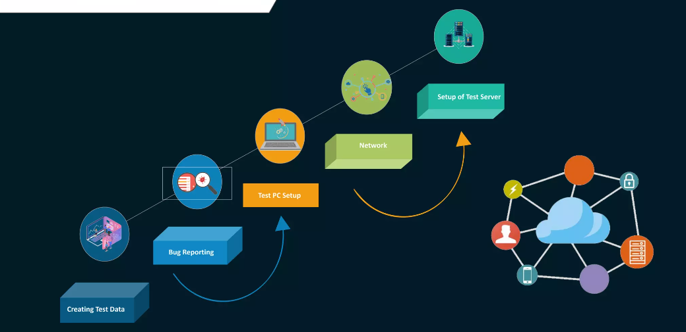

# Software Testing Life Cycle (STLC)
- The Software Testing Life Cycle (STLC) is a process used to ensure that software products are tested thoroughly before they are released to end-users.
-  It consists of several phases, each of which has its own objectives and tasks.
## STLC Phases Overview

### Phases of STLC
##### 1. Requirement Analysis
- In this phase, the requirements are analyzed and documented to understand the scope of testing.
- QA team understands the requirements.
- Testing team studies the requirements.
- Requirements are either functional or non-functional.
-  ###### Types of Requirements
   

##### 2. Test Planning
- In this phase, the test strategy and test plan are defined based on the requirements and risks associated with the software product.
- It helps us determine the effort needed to validate the application
- Test Plan guides our thinking
- Important aspects are documented in Test Plan 
-  ###### Planning process :
   

##### 3. Test Case Development
- This phase started once test planning is finished.
-  In this phase, the test cases are designed by testing team and these test cases are reviewed by peer members or QA lead .
 - ###### Rules to be followed while designing test cases:
   

##### 4. Test Environment Setup
 - ###### Determine the type of testing environment required.
    -The testing environment needed may vary depending on the type of testing being performed, such as functional testing, performance testing, security testing, or compatibility testing.
 - ###### Identify the hardware and software requirements.
 - ###### Determine the location of the testing environment.
     - Decide where the testing environment will be located, such as in-house or at a remote location, and whether it will be a physical or virtual environment.
 - ###### Set up the testing environment.
     -  Install the necessary software and hardware components,
 - ###### Verify the testing environment.
     - Test the environment to make sure that it is working correctly and that all components are functioning as expected.
 - ###### Document the testing environment 
    - Document the testing environment setup process, including hardware and software configurations, network settings, and any other relevant information.
   ##### 
##### 5. Test Execution
-  In this phase, the test cases are executed, and defects or issues are identified, tracked, and reported.
-  Testing team starts executing test cases,if any test case failed then corresponding defect reported to developer team.
-  if any test cases are blocked then such are marked as blocked.

##### 6. Test Reporting / Test Closure : 
- In this phase, the test results and defects are reported to the stakeholders, and the final testing summary report is prepared.
   

- In this phase, the testing is completed, and the final sign-off is given by the stakeholders to release the software product
   
   
## Entry Criteria and Exit Criteria:
 - Entry criteria is a set of conditions that permits a task to perform, or in absence of any of these conditions, the task cannot be performed.
 - Exit criteria is a set of expectations; this should be met before concluding the STLC phase.
 - The QA team does not proceed with the next phase until the exit criteria of the current phase meets. 
 - The entry criteria should include the completion of exit criteria of the previous phase.
 - For Instance, to start the Test Cases development phase, the following conditions should be met :
      -   The requirement document should be available.
      -   Complete understanding of the application flow is required.
      -   The Test Plan Document should be ready.
<<<<<<< HEAD
- For Instance, to conclude the Test Cases development phase following expectations should be met :
     - Test Cases should be written and reviewed.
     -   Test Data should be identified and ready.
     -   Test automation script should be ready if applicable.
=======
- For Instance, to conclude the Test Cases development phase, following expectations should be met :
      -  Test Cases should be written and reviewed.
      -  Test Data should be identified and ready.
      -  Test automation script should be ready if applicable.
>>>>>>> 7f1e54e411f61d904699f5e7e589eb941061ac9d

## Conclusion
- Overall, STLC helps to ensure that the software product is thoroughly tested and meets the quality standards before its release to the market.
## Q&A
## ----------------------      Thank You    --------------------------
